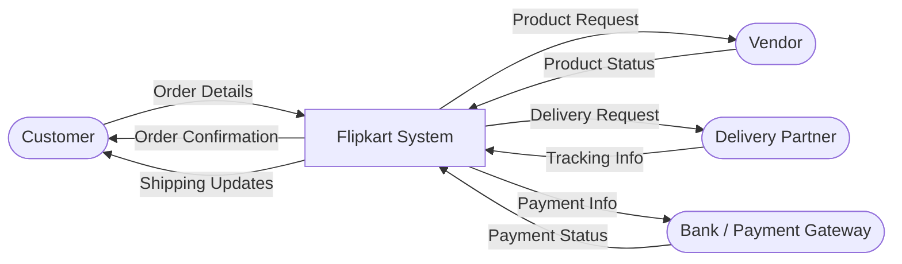
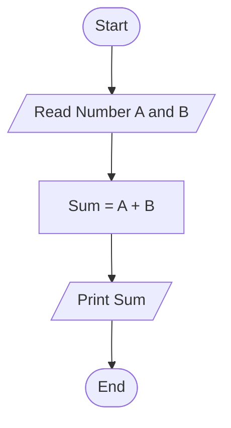
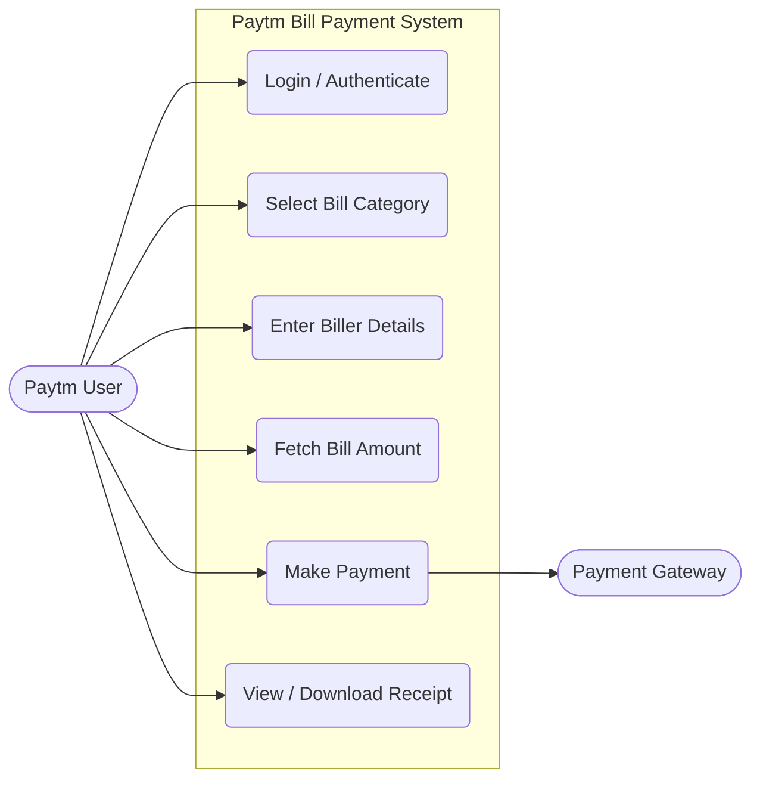

# Module 1: SDLC Assignment

## What is software? What is software engineering?
- **Software**: Software is a set of instructions, data, or programs used to operate computers and execute specific tasks. It is the opposite of hardware, which describes the physical aspects of a computer. Software is a generic term used to refer to applications, scripts, and programs that run on a device.
- **Software Engineering**: Software engineering is the systematic application of engineering approaches to the development of software. It encompasses the principles, methods, and tools used to design, develop, test, and maintain software systems efficiently and effectively.

## Explain types of software
Software can be broadly classified into three main types:
1. **System Software**: Designed to run a computer's hardware and application programs. The system software acts as the interface between the hardware and user applications. Examples include Operating Systems (like Windows, Linux, macOS) and device drivers.
2. **Application Software**: Also known as end-user programs or productivity programs, these help users perform specific tasks. Examples include Web browsers (like Chrome), Word processors (like MS Word), and Media players.
3. **Programming Software**: Tools that help programmers write, test, and debug other software programs. Examples include Compilers, Text editors, Debuggers, and Integrated Development Environments (IDEs) like VS Code.

## What is SDLC? Explain each phase of SDLC
**SDLC** stands for **Software Development Life Cycle**. It is a structured process used by the software industry to design, develop, and test high-quality software.

**Phases of SDLC:**
1. **Requirement Analysis**: Defines the system's requirements and constraints with inputs from customers, domain experts, and stakeholders.
2. **Planning**: Identifies the project scope, technical feasibility, resources needed, and creates a project plan with schedule and cost estimations.
3. **Architectural Design**: Transforms requirements into a system architecture, defining hardware/software requirements and overall system components.
4. **Software Development (Coding)**: The actual writing of the code by developers according to the design documents.
5. **Testing**: The software is tested for defects and bugs to ensure it functions as expected and meets the requirements.
6. **Deployment**: The software is deployed to the production environment where end-users can access and use it.
7. **Maintenance**: Regular updates, bug fixes, and feature enhancements to ensure continuous functionality.

## What is DFD? Create a DFD diagram on Flipkart
**DFD (Data Flow Diagram)**: A Data Flow Diagram maps out the flow of information for any process or system. It uses defined symbols to show data inputs, outputs, storage points, and the routes between each destination.

**Flipkart Context-Level DFD (Level-0):**

## What is Flow chart? Create a flowchart to make addition of two numbers
**Flowchart**: A flowchart is a visual representation of a sequence of steps and decisions needed to perform a process. Each step in the sequence is noted within a diagram shape, linked by connecting lines.

**Flowchart for the addition of two numbers:**

## What is Use case Diagram? Create a use-case on bill payment on Paytm.
**Use case Diagram**: A use-case diagram is a modeling technique that represents the interactions between users (actors) and a system to achieve a specific goal. It illustrates the system's functionality from a user's perspective.

**Use-case diagram for Paytm Bill Payment:**

